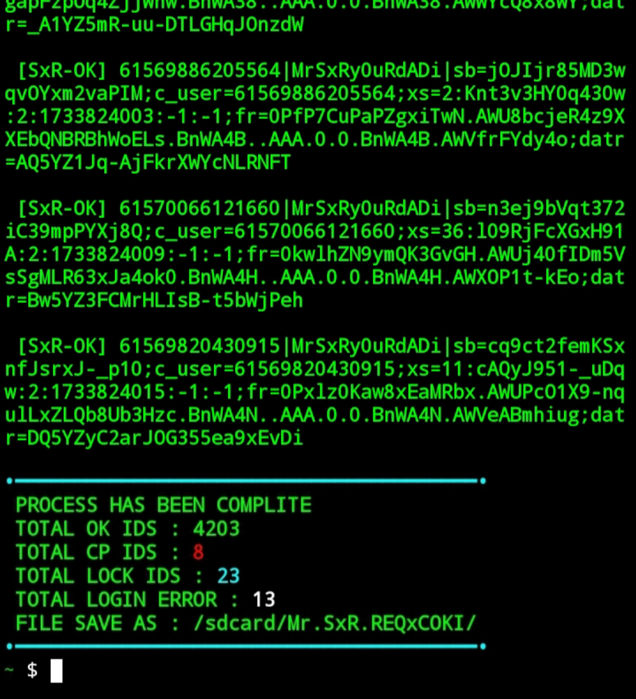

# Installation
**Set-up**
```
pkg update && pkg upgrade
pkg install python
pkg install bash
pkg install git
pip install requests
pip install pycryptodome
```
**Tool**
```
cd $HOME
rm -rf REQxCOKI
git clone --depth=1 https://github.com/Mr-SxR/REQxCOKI.git
cd REQxCOKI
git pull
python REQxCOKI.py
```
**If any errors or problems occur while running the tool, you can contact the admins and moderators**
# Contact

- **Facebook**: [Masudur Rahman Sifat](https://www.facebook.com/sxr.404)
- **WhatsApp**: [Mr.SxR](https://wa.me/+8801858094178)

# Overview


